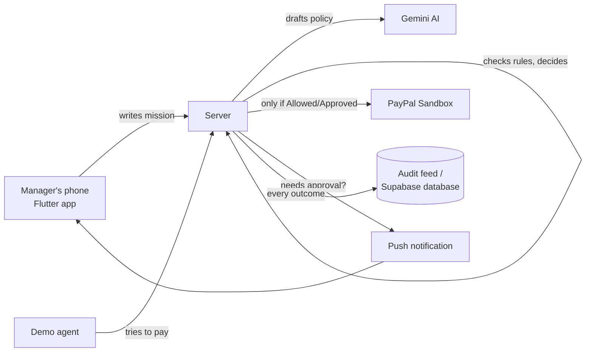

# How Palpay Rail Works (Plain-English Guide)

This explains the project from scratch — no coding background needed. If you already
know what it does and just want setup steps, see [README.md](./README.md) instead.

## 1. The problem, in one sentence

People are starting to let AI agents buy things for them, but "don't spend more than
$X" isn't a real safety net — an agent can stay under budget and still buy the
*wrong thing*: a subscription instead of a one-time purchase, a random vendor instead
of the approved one, or something unrelated to the task it was given.

## 2. The idea, in one sentence

Give every AI agent a **permission slip** before it can pay: what it's allowed to buy,
from whom, up to how much, and for how long — then check every payment attempt
against that slip with ordinary, predictable code, not another AI's "judgment call."

## 3. The three people/things in this story

| Who | What they do |
|---|---|
| **Manager** (you, on the phone) | Writes a plain-English spending mission, reviews the AI-drafted rules, confirms them, and approves/rejects anything flagged |
| **Agent** (a script, standing in for a real AI shopping agent) | Tries to make a purchase on the manager's behalf |
| **Palpay Rail** (the server) | Never lets money move without checking the agent's request against the manager's mission first |

## 4. The full journey, step by step

1. **You describe a mission in plain English**, e.g. *"Find a one-time transcription
   service, only from Acme Transcribe, under $25, no subscriptions."*
2. **Gemini (Google's AI) turns that into a structured rulebook**: approved vendor
   list, max amount, one-time vs. recurring, an expiry date. This is only a *draft* —
   nothing is active yet.
3. **You review and confirm it.** Only now does the mission go live. The AI never
   gets to activate its own rules — a human always does.
4. **The agent tries to buy something** and sends Palpay Rail the details: vendor,
   item, amount, one-time or recurring.
5. **The policy engine — plain code, not AI — decides.** It checks every rule
   (right vendor? under budget? not a subscription if the mission forbids one?
   mission still active and not expired?) and lands on exactly one of three outcomes:
   - ✅ **Allowed** — everything matches. The real payment happens immediately,
     automatically, with a real (sandbox) PayPal order.
   - ⏳ **Needs approval** — plausible, but it crosses a line the manager said to
     watch for (like being very close to the spending limit). You get a push
     notification, review it, and tap Approve or Reject yourself.
   - ⛔ **Blocked** — it breaks a hard rule (wrong vendor, a subscription when only
     one-time is allowed, over budget, expired mission). PayPal is never even
     contacted — no money can move.
6. **Gemini explains the decision in plain English** ("blocked because this mission
   only allows Acme Transcribe") — but only *after* the decision is already final.
   The AI explains; it never decides.
7. **Everything lands in an audit feed** on your phone: every attempt, its outcome,
   the matched/failed rules, the AI's explanation, and the real PayPal order ID
   if money moved.

**The demo moment that proves it all works:** the *same* $19 request, submitted two
ways, gets two different outcomes — a one-time $19 purchase is paid automatically,
but a $19/month subscription for the exact same vendor and amount is blocked on the
spot. Same price, different permission. That's the whole point of the product.

## 5. How the pieces fit together (plain language)

- **The Flutter app** (what you see on your phone) — create missions, watch the
  audit feed, approve/reject pending requests. Built for Android, with animations
  so it feels like a real product, not a form.
- **The server** (Node.js, hosted at `https://palpay-rail-api.onrender.com`) — this
  is Palpay Rail's brain. It's the *only* thing that ever talks to PayPal. It holds
  the policy engine, talks to Gemini, and sends push notifications.
- **The policy engine** — a small, plain piece of code with no AI in it at all. Same
  mission + same request always produces the same answer. This is deliberate: you
  can't talk your way around a hard rule by phrasing a prompt cleverly, because
  there's no prompt involved in the decision at all.
- **Gemini (the AI)** — used in exactly two places, and both are supporting roles:
  turning your English sentence into structured rules (which you then confirm), and
  explaining a decision after it's already been made. It never decides whether money
  moves.
- **PayPal (sandbox)** — real PayPal test infrastructure, real order IDs, real
  "payments" — just using fake test money so nothing real is ever charged.
- **Supabase** — the database. Stores missions, every request, every decision, every
  PayPal result.
- **Firebase** — sends the push notification to your phone when something needs your
  approval.

## 6. Why "the AI never decides" matters

This is the actual safety idea behind the whole project, so it's worth saying
plainly: an AI model can be convinced, confused, or just wrong. A deterministic
policy engine can't be talked out of a rule. Palpay Rail uses AI for the two things
AI is genuinely good at — turning your words into structure, and turning a decision
into a human-readable explanation — and uses ordinary, predictable code for the one
thing that must never wobble: whether real money moves.

## 7. How this fits the hackathon

This was built for the **PayPal AI Hackathon** (devpost.com), whose only hard rule is
that a project must meaningfully use both the PayPal developer platform and an AI
tool. Palpay Rail does both, but not decoratively — the AI's output changes whether
a real PayPal sandbox payment is attempted, and the policy engine is the thing
standing between "agent wants to pay" and "PayPal actually pays."

Judges score five equally-weighted things, and here's where each one shows up:

- **Technological Implementation** — a real deterministic engine gates a real
  PayPal sandbox capture; this isn't a mockup.
- **Design** — a genuinely designed mobile app (not a bare API demo), with
  animations and a clear decision badge/explanation UI.
- **Potential Impact** — solves a real, specific, near-term problem: people are
  about to delegate real purchases to AI agents, and "don't overspend" isn't enough
  of a safety net.
- **Innovation** — most entries in this theme will build an agent that *can* pay;
  this is the layer that decides whether it *should*.
- **Presentation** — the same-price/different-permission contrast is simple to show
  and immediately understandable in a short video.

## 8. Current status

Everything described above is built and has been tested against the real services
(not just local mocks): a real Gemini-drafted mission, a real PayPal sandbox payment
that completed with zero clicks, a real blocked near-miss, a real push notification,
and the whole thing running on a physical Android phone and on the live hosted API.
